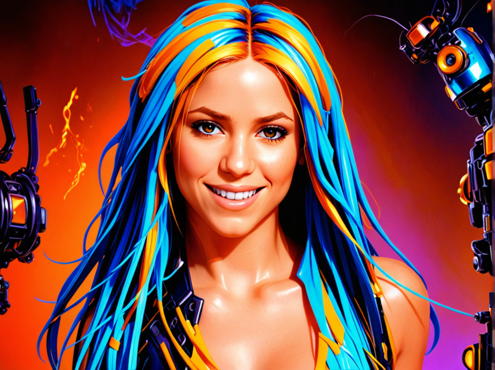

# Mad Scientist

> This feature requires vision capabilities.
>
> You must either have the **Ollama** server running with the **llava:7b-v1.6-vicuna-q8_0 model**,
> or provide a `Gemini API key` in the settings.

There are only two required arguments:

1. Source file with a person's face.
2. The file from which style will be created and applied to the source file.

The results of this flow are amazing.

## Hardware requirements

Depends on whether the Ollama server is running locally or remotely.

It can run on Macbook 32GB (including Ollama running locally on the same device)

Since the Ollama model used here requires 7GB models and uses SDXL models from the workflow, it will likely require a 16GB memory card to run it on the GPU.

But you can always run Ollama on a CPU or other device and after that a 10GB graphics card will be enough.

## Examples

