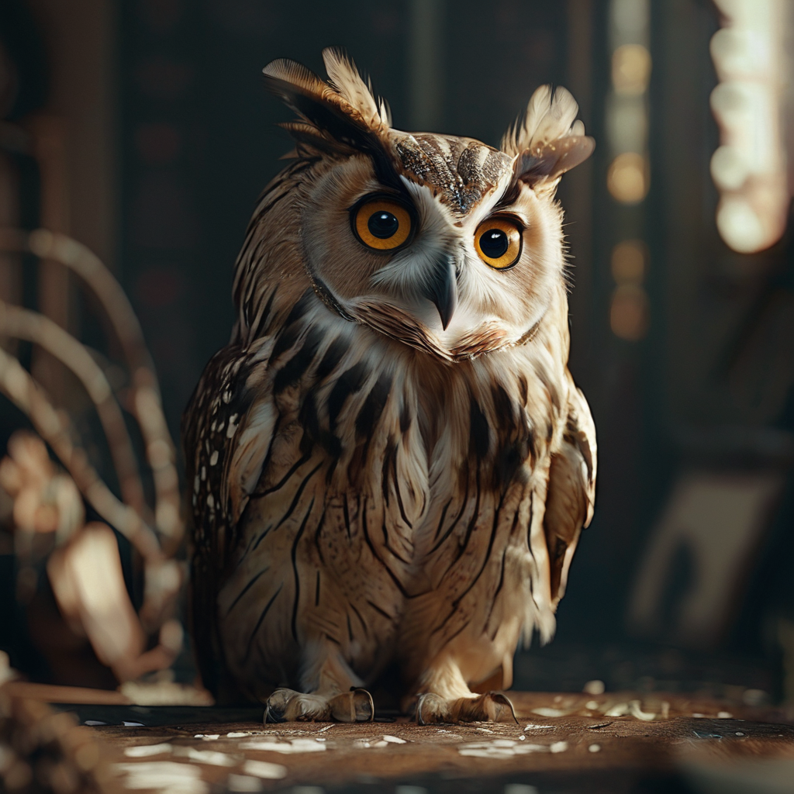

# Mobius XL

A fairly simple flow at the moment, simply using the latest [Mobius](https://huggingface.co/Corcelio/mobius) model without any post-processing.

> *This is a very unusual model, although it is part of the SDXL family of models - its results in some areas are simply amazing.*

It has better text drawing capabilities than other SDXL models.

Since the author of this model is constantly improving it, we will update it with new versions when they are published.

Here is a link to [civitai](https://civitai.com/models/490622/mobius) to learn more about the model.

Link to the author of the model on [Twitter](https://x.com/DataPlusEngine)

**Supports fast generation using the Align Steps technique**

## Examples

    emotional owl looks at the viewer in surprise, masterpiece, cinematic, best quality

---

    very angry emotional pug, future, best quality, masterpiece, cinematic, ("VIX" text logo)

---

    portrait of male paratrooper, explosions background, masterpiece, cinematic, best quality
