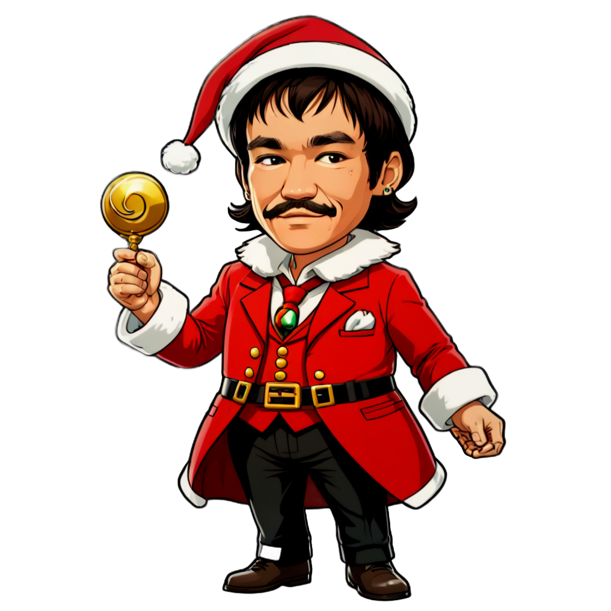

# Photo Stickers 2

> This feature requires vision capabilities.
>
> You must either have the **Ollama** server running with the **llava:7b-v1.6-vicuna-q8_0 model**,
> or provide a `Gemini API key` in the settings.

Turns a photo into 4 stickers using different prompts.

Part of the flow runs on the CPU, part on the GPU, the flow is quite fast and convenient for everyday use.

Original flow/idea examples: [StickerYou - 1 photo for stickers](https://openart.ai/workflows/rui400/stickeryou---1-photo-for-stickers/e8TPNxcEGKdNJ40bQXlU)

## Examples

> As input file, the photo of `Bruce Lee` was taken from the Internet and used with default prompts.

