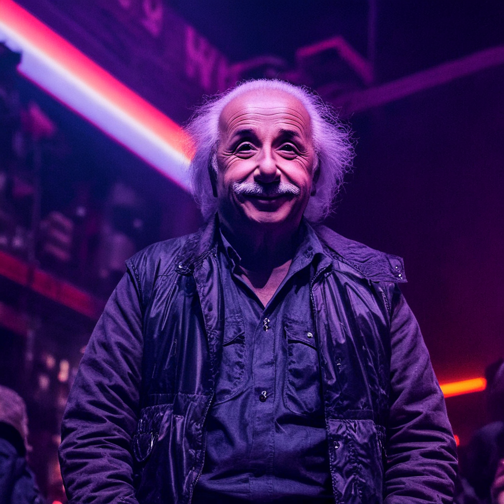
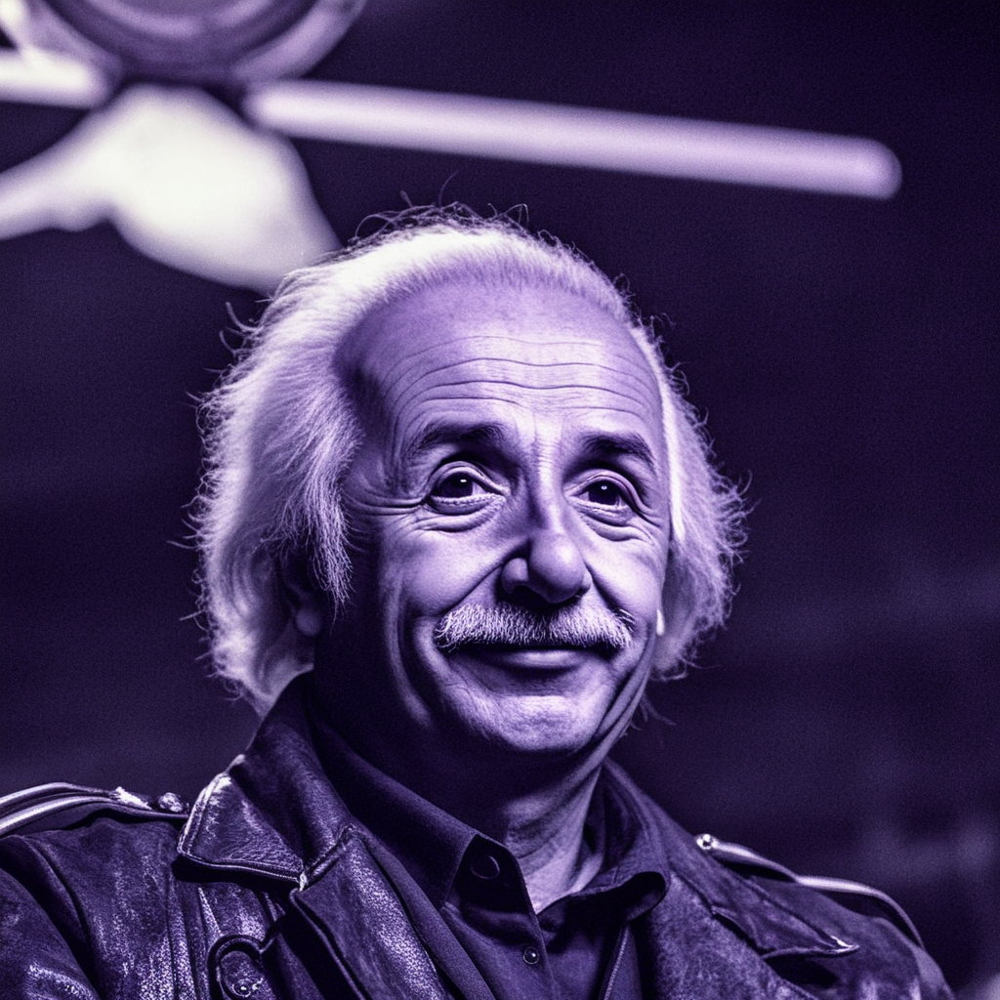
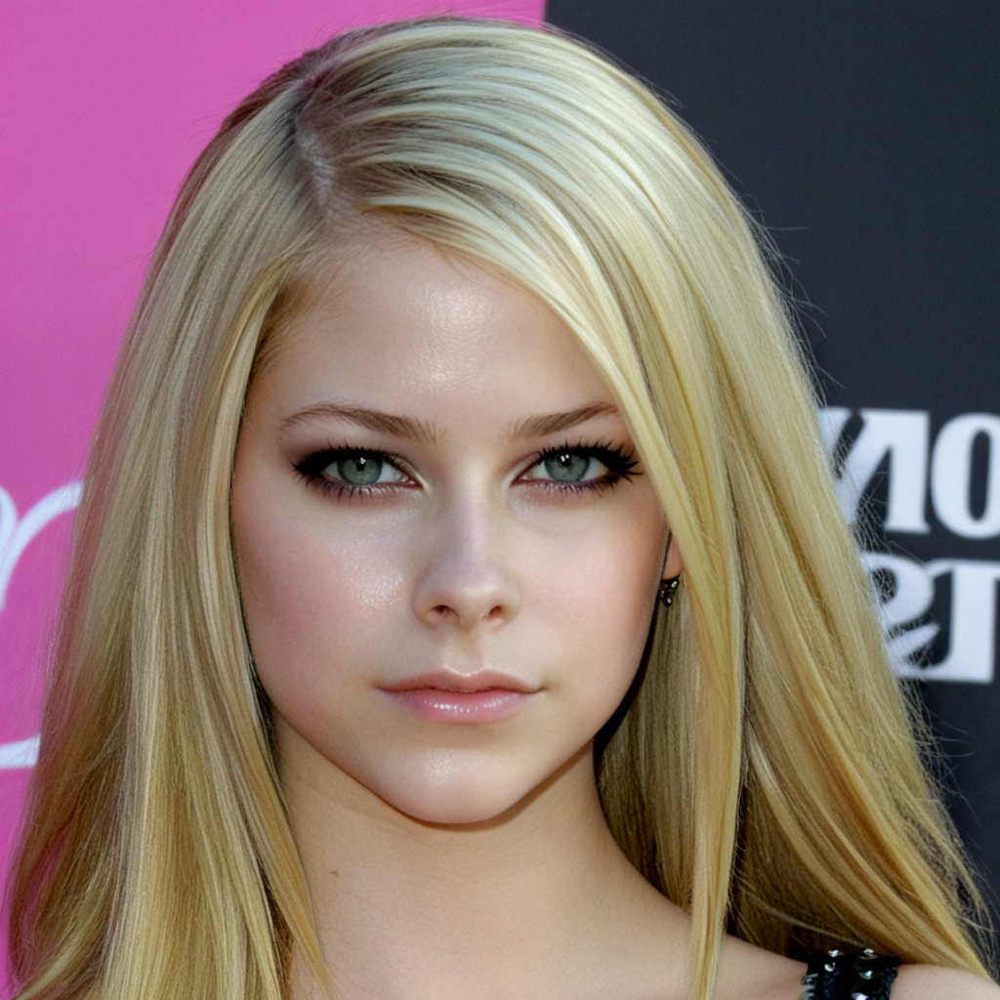
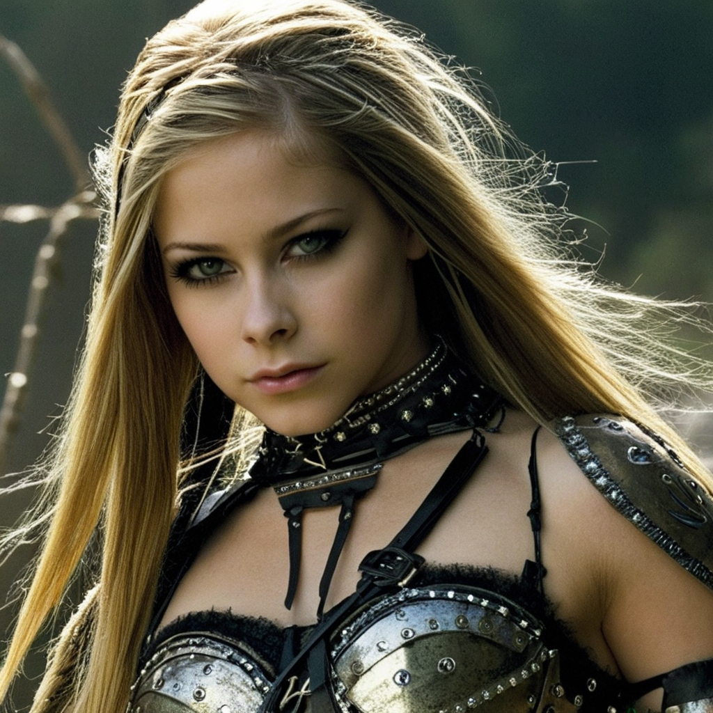
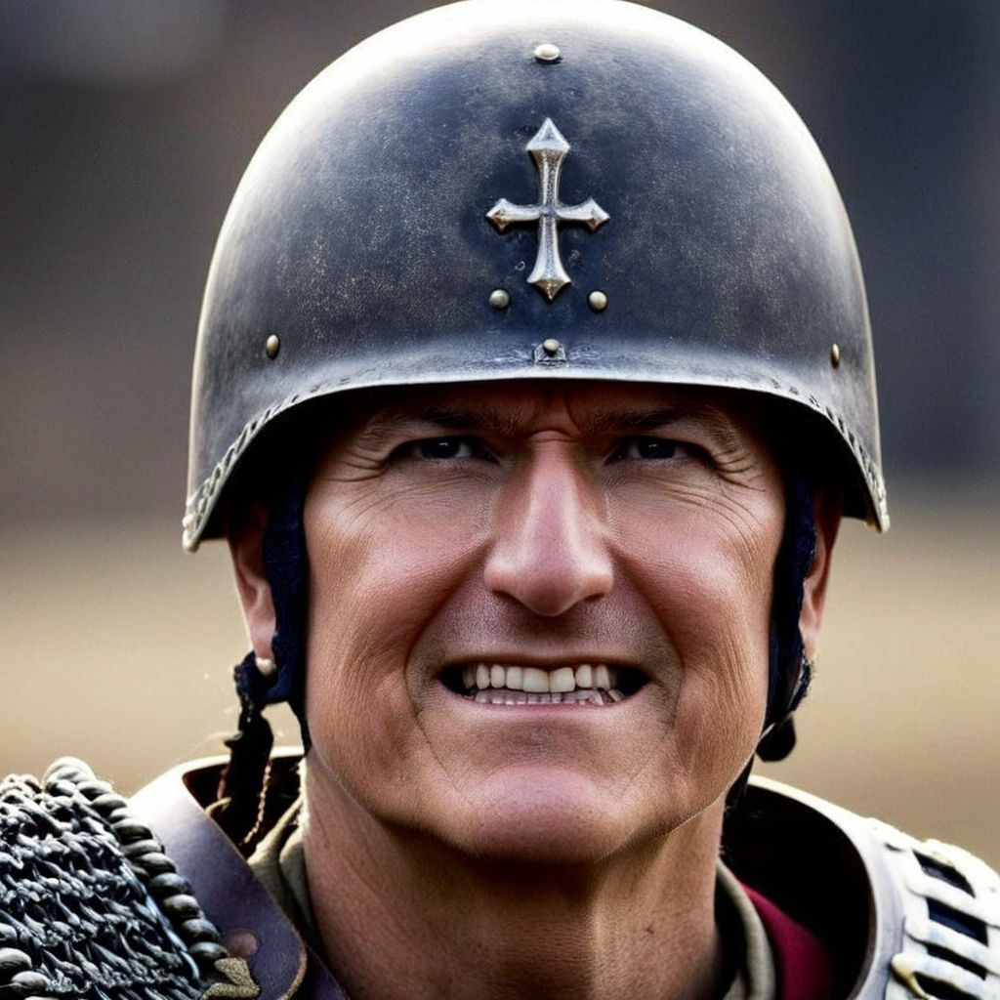

# Photomaker 2

This flow is based on the second version of Tencent's model. Its results are significantly better, but there are a few caveats:

1. The flow is highly sensitive to the input photos and their angles.

    (*ideally, you should provide 3 photos: a profile, slightly from the left, and slightly from the right*)

2. At least 2 photos are required, but sometimes 3-4 are needed to achieve acceptable results.

!!! note

    We have added face cropping and background removal to this flow, si no need to select an input where the face occupies a large portion of the image.

    This flow produces 3 results instead of 2, so it takes a bit longer to process.

    Advanced parameter **Accuracy** currently applies only to two of the three result images.

    **Recommended words to include in the prompt**: woman/girl/man/boy

## Examples

> The images of `Albert Einstein`, `Avril Lavigne`, and `Tim Cook` were taken from the Internet and used as a base.

    photo of a very happy man

- Style: Neopunk

---

    photo of a warrior girl

- Style: No Style

---

    photo of an angry ancient soldier man

- Style: Photographic (Default)
