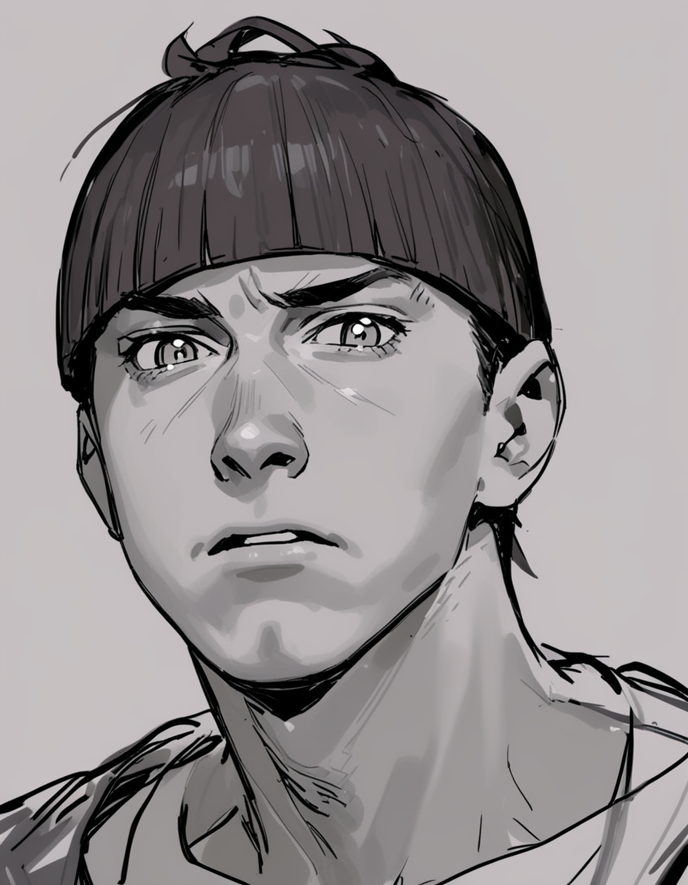
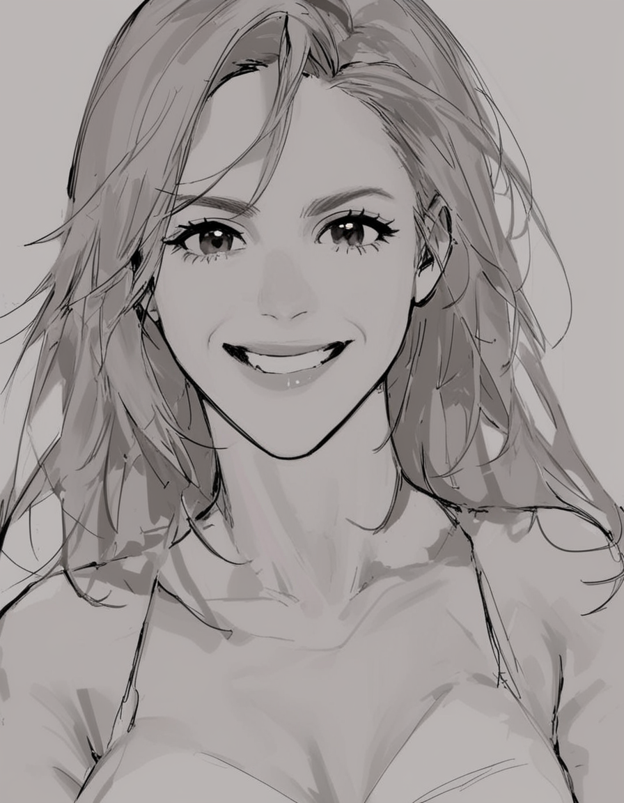
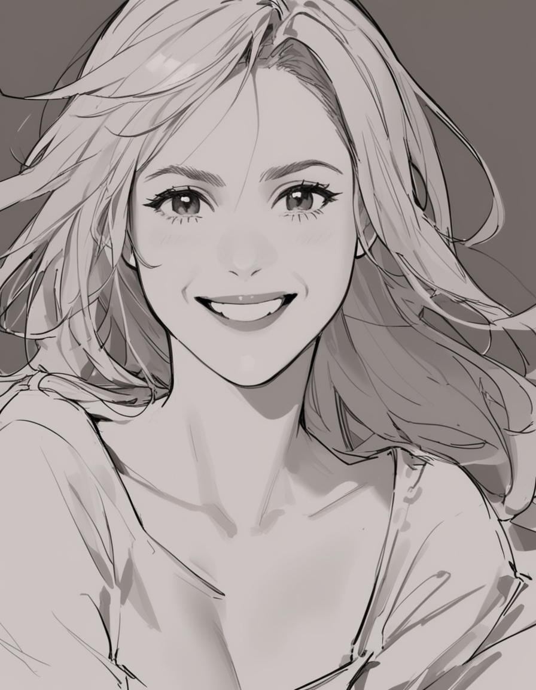

# Sketch Portrait

Quick creation of an anime sketch from a photograph of a person.

**Prompt** is optional, something like emotions can be used there: *smile, sad, serious, etc*.

Part of the flow runs on the CPU, part on the GPU, the flow is very fast and convenient for everyday use.

## Examples

> The input files were taken from the Internet and used photographs of `Shakira`, `Steve Jobs` and `Eminem`.

