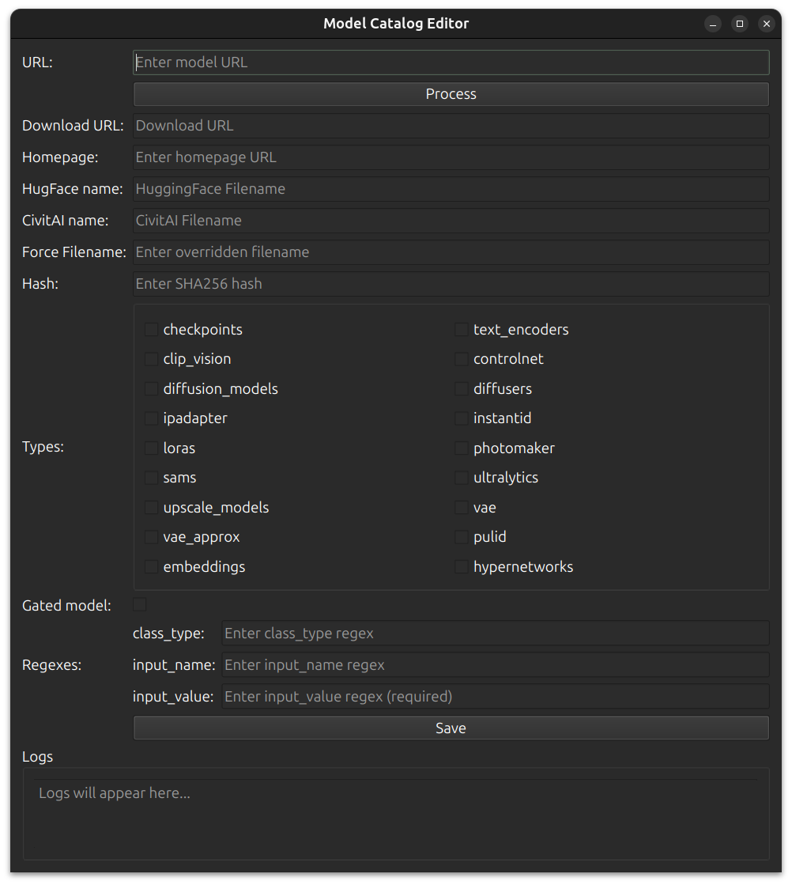

## Introduction

Visionatrix uses a `models_catalog.json` file to automatically map nodes in ComfyUI workflows to their corresponding models, ensuring a seamless user experience.

If you use a model that is missing in the current catalog, you can now easily add it using our new Model Catalog Editor tool.

This tool helps you create consistent and accurate entries in `models_catalog.json` by guiding you through setting the model’s URL, homepage, filename, hash, and classification ("types").

---

## Optional Auth Tokens

If you have authentication tokens for [Hugging Face](https://huggingface.co/) or [CivitAI](https://civitai.com/), the tool can use them to fetch metadata and check gated models.
It will attempt to read these tokens from the Visionatrix database if available.

The script looks for the database in the `../Visionatrix` directory, so if both repositories are cloned in the same parent directory, the setup should work seamlessly.

!!! note

    Lack of access to the database or missing tokens does not prevent adding models, but certain features (like checking gated models) may be limited.

---

## Launching the Editor

The `models_catalog_editor.py` file is located in the `VixFlowsDocs` repository at its root. You will also find a `requirements_catalog_editor.txt` file there. To start:

1. **Install Dependencies** (if needed):

   ```bash
   pip install -r requirements_catalog_editor.txt
   ```

2. **Run the Editor**:

   ```bash
   python models_catalog_editor.py
   ```

This opens a GUI window:



---

## Using the Model Catalog Editor

### Step 1: Provide the Model Source URL

In the "URL" field, enter the direct link to your model. Supported sources:

- **Hugging Face**: e.g., `https://huggingface.co/{user}/{repo}/blob/main/model.safetensors`
  *The editor automatically corrects `/blob/` links to `/resolve/` if necessary.*

- **CivitAI**: Provide a link that includes a `modelVersionId` query parameter or a link to a model/version page. The tool will attempt to fetch metadata and files associated with that model.

Click **Process**. The editor then tries to:

- Fetch a homepage URL.
- Propose a default filename.
- Check if the model is gated (requires auth token).
- For CivitAI, it lists all available files and their hashes, prompting you to choose one if multiple are found. It also attempts to determine the correct model `type` from the metadata.

---

### Step 2: Confirm or Edit the Download URL, Homepage, and Filenames

- **Download URL**: The tool sets this automatically for known sources. You can adjust it if needed.
- **Homepage**: For Hugging Face, this is usually the repository root. For CivitAI, it's the model’s main page. You can also enter a custom homepage if necessary.
- **Filenames**:
  The editor attempts to determine a good filename. If your model came from Hugging Face and also exists on CivitAI, you might see a "HugFace name" and a "CivitAI name".
  If the suggested filenames are not suitable (e.g., too generic like `model.safetensors`), provide a "Force Filename" to ensure uniqueness and clarity.

---

### Step 3: Verify the Hash

The editor tries to fetch a SHA256 hash for the model:

- For Hugging Face models with a supported configuration, it reads the `X-Linked-ETag` header as a hash.
- For CivitAI models, it uses the provided file hash from the metadata.

If the hash is not found, enter it manually in the "Hash" field. The hash is crucial for ensuring model integrity and facilitating quick checks by Visionatrix.

---

### Step 4: Set Model "Types"

"Types" determines where the model file will be stored inside ComfyUI’s directory structure. Common types include:

- `checkpoints`
- `diffusion_models`
- `loras`
- `controlnet`
- `embeddings`
- `vae`
- ... and more.

The tool tries to infer a type from the model’s metadata. However, for certain models (like SD3.5 or Flux models), the correct type may not be determined automatically. In such cases, **you must manually select the correct type** from the checkboxes.

**Tip**: If unsure, consider:

- `diffusion_models` or `checkpoints` for base diffusion models.
- `loras` for LoRA-based models.
- `controlnet` for ControlNet-based models.
- `embeddings` for textual inversion embeddings.

---

### Step 5: Set Gated (if Needed)

If the model is gated (e.g., private or requires a Hugging Face token to download), check the "Gated" box. This ensures Visionatrix knows it needs an authorization token for downloading.

---

### Step 6: Define the Regexes

Regexes help Visionatrix identify which model entry applies to a given node in a ComfyUI workflow. You can set:

- `class_type` regex: Matches the ComfyUI node’s `class_type`.
- `input_name` regex: Matches the input parameter name of the node parameter that holds the model filename.
- `input_value` regex: **Required** to match the actual input value from the workflow (e.g., the filename or part of it).

**Important**:
- `input_value` is mandatory. It should match the final filename or a portion of it.
- Use a pattern that is flexible enough to capture variations in filenames, but not so broad it conflicts with other models.

For example, if your filename is `my-special-model.safetensors`, a suitable `input_value` might be:

```regex
(?i)(?:[^\/\\]*[\/\\]?)?my-special-model\.safetensors$
```

If you have multiple filenames (like a Hugging Face name and a CivitAI name), the tool tries to create a regex that matches them all. Adjust the regex if necessary to ensure uniqueness and correctness.

---

### Step 7: Save the Entry

Once you have verified all fields:

- Click **Save**.
- Choose or confirm a unique model name key. The tool ensures no conflicts with existing keys. If there's a hash conflict, you can overwrite or rename the key.
- On successful save, the model entry is added to `models_catalog.json`.

---

## Conclusion

With this utility, adding new models has become easy and efficient.

After saving your changes locally, consider sharing your `models_catalog.json` updates by submitting a pull request to the VixFlowsDocs repository.
